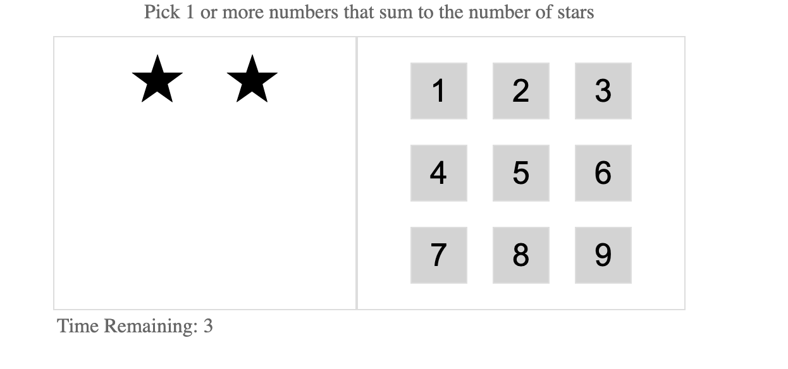
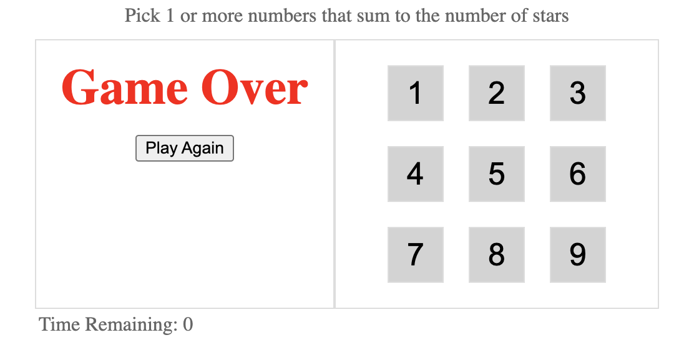
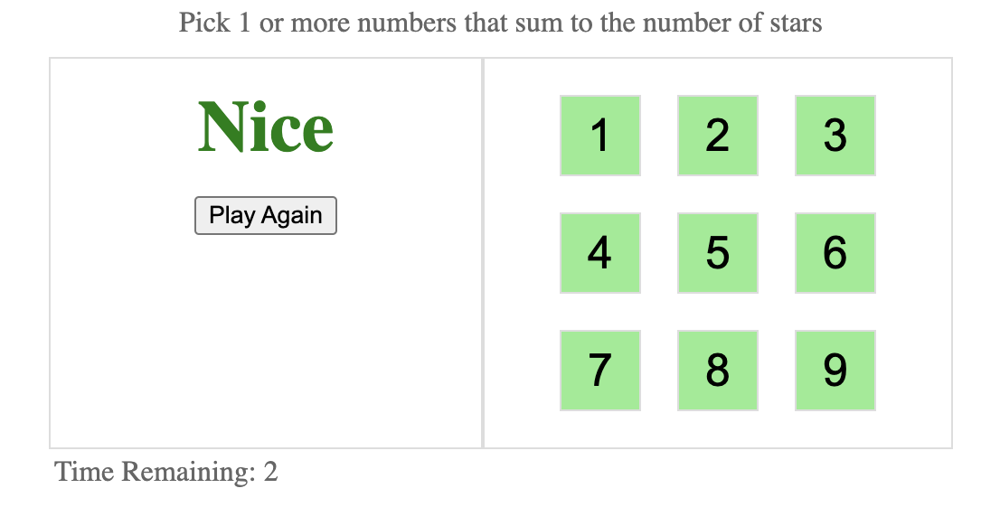

# Star Game in React

This is a simple game build in react using simple react features. Game logic is easy:

1. Random number of strars is shown on the left side
2. Sum of the numbers in the right side should match the number of starts in the left
3. You have to complete the game before the timeout reaches to 0

## How to run the game

Running the game is easy, just run this commands:

`npm i`

`npm start`

## Game Screenshots

